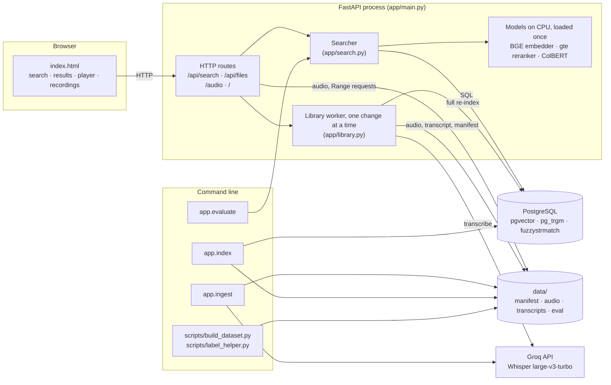
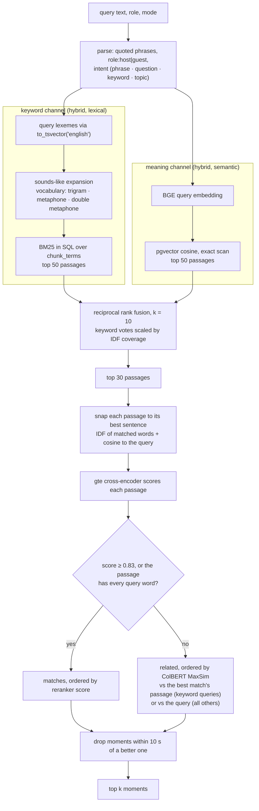
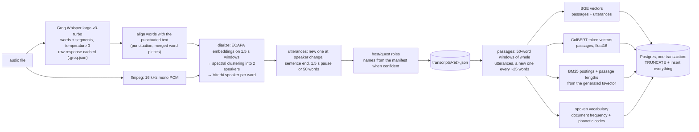
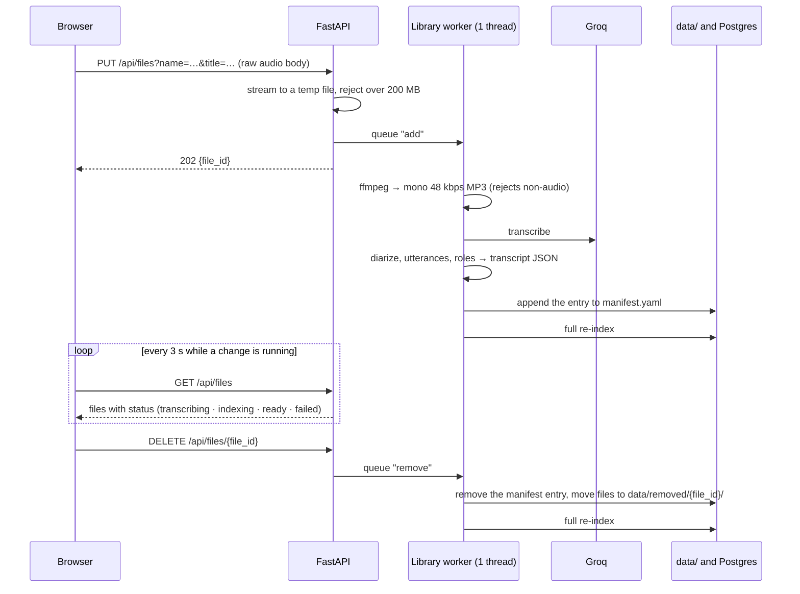
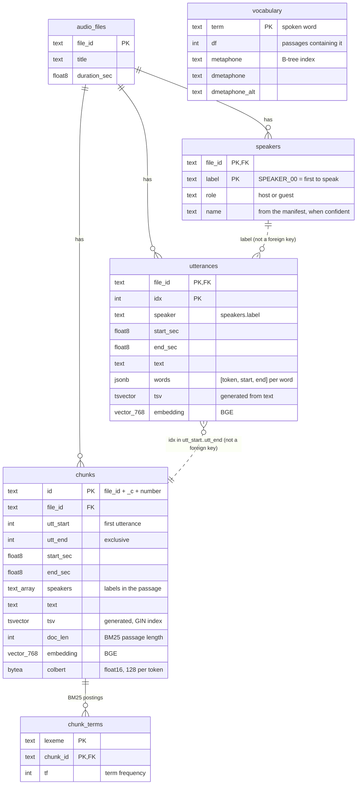
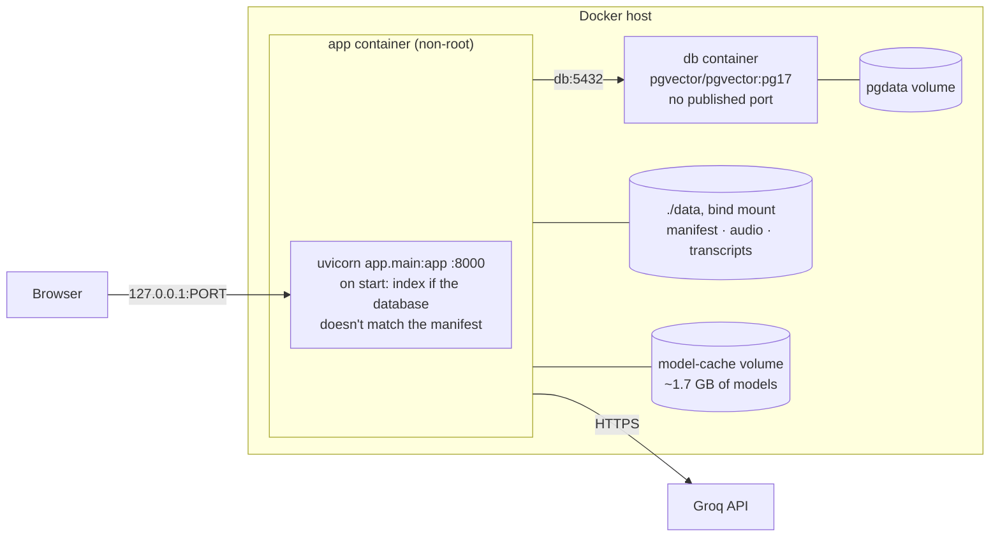

# SonicSearch architecture

SonicSearch searches what was said in audio recordings. Each result is a **moment**: the recording, the time to play from, who said it (host or guest, by name when known), the sentence with the matching words highlighted, and whether it's a confident **match** or **related** context.

It's a single FastAPI process with the models loaded in memory, one PostgreSQL database (pgvector, pg_trgm, fuzzystrmatch) and a `data/` folder. There's no build step and no separate search or vector service. This document describes the code as it is. [docs/TDD.md](docs/TDD.md) describes an earlier reference design (local faster-whisper ASR, optional reranking); where the two differ, this document is current. Measurements behind the decisions are in [docs/EVALUATION.md](docs/EVALUATION.md) (decision log #1–#14).

## System overview



| Component | Code | Responsibility |
|---|---|---|
| Web page | `app/static/index.html` | Search form (query, mode, speaker), results with highlights, audio player, recordings list with upload and remove. No framework; the URL holds the search state. |
| API | `app/main.py` | Search, recordings (list, upload, remove), audio files with Range support, the page itself. Loads the models once at startup. |
| Search | `app/search.py` | Query parsing, both retrieval channels, fusion, sentence snapping, reranking, related ordering, duplicate removal. |
| Models | `app/embed.py` | BGE sentence embeddings, and a hand-written ColBERT encoder with MaxSim scoring. The gte cross-encoder comes from sentence-transformers. |
| Ingest | `app/asr.py`, `app/diarize.py`, `app/transcript.py`, `app/ingest.py` | Audio → words with timestamps → speaker per word → utterances → host/guest roles → transcript JSON. |
| Index | `app/chunking.py`, `app/text.py`, `app/index.py` | Transcripts → passages, vectors, BM25 postings and spoken vocabulary in Postgres. |
| Library | `app/library.py` | Upload and removal jobs, the manifest, and the re-index after every change. |
| Evaluation | `app/evaluate.py`, `data/eval/` | Scores the live search path against the golden queries. |

## Search request

`GET /api/search?q=…&k=10&role=host|guest&mode=hybrid|lexical|semantic`



Quoted phrases (`phraseto_tsquery`) and the speaker filter are applied as SQL `WHERE` clauses on both channels. With a speaker filter, snapping also only considers that speaker's sentences. User input only ever reaches SQL as bound parameters.

A real hit, for `cesium`:

```json
{"rank": 1, "file_id": "telling_time", "title": "Telling Time on Other Worlds",
 "start": 399.81, "end": 401.03, "match_time": 400.43, "timestamp": "06:39.8",
 "speaker": "SPEAKER_01", "role": "guest", "name": "Kevin Coggins",
 "text": "It could be cesium.", "highlights": [[12, 18]],
 "score": 0.81536, "channels": {"lexical": 1, "dense": 1}, "related": false}
```

`start` is where to play from (the sentence start). `match_time` is when the first highlighted word is spoken. `highlights` are character spans in `text`. `channels` gives the rank in each channel that found the passage.

## Ingest and indexing



`python -m app.ingest` builds transcripts and `python -m app.index` builds the index. The web app runs the same two functions (`build_transcript()`, `reindex()`) for uploads. The models run *before* the index transaction opens, so searches are only blocked for the few seconds of writes, not the whole re-index.

## Recording upload and removal



## Data model

### Database schema



| Table | Rows (6 dataset files) | Role |
|---|---|---|
| `audio_files` | 6 | One row per recording; everything else cascades from it. |
| `speakers` | 12 | Speaker label → role and name, per recording. Used for the speaker filter and for naming results. |
| `utterances` | 586 | What users see: one speaker's sentence or turn, with word timings for `match_time` and highlights. |
| `chunks` | 241 | What gets retrieved: overlapping ~50-word passages that can span both speakers, so a question stays next to its answer. |
| `chunk_terms` | 5,669 | BM25 postings: one row per (lexeme, passage) with its count. Postgres has no BM25, so it's computed in SQL from these. |
| `vocabulary` | 1,321 | Every spoken word with its document frequency and phonetic codes, for typo and ASR-spelling expansion. Trigram (GIN) and metaphone indexes. |

`app/schema.sql` runs on every startup and every re-index. It's idempotent: `CREATE … IF NOT EXISTS`, plus `ALTER TABLE … ADD COLUMN IF NOT EXISTS` for columns added later. There's no vector index; see AD-5.

### Files on disk

```
data/
├── manifest.yaml              # the corpus: one entry per recording (dataset files + uploads)
├── audio/<file_id>.mp3        # served to the player; uploads are converted to mono 48 kbps MP3
├── transcripts/
│   ├── <file_id>.groq.json    # raw ASR response (cache: rebuilding never re-calls Groq)
│   └── <file_id>.json         # canonical transcript: utterances, words, speakers, roles
├── eval/queries.src.yaml      # hand-written queries (utterance ranges)
├── eval/queries.yaml          # generated labels (time intervals + quotes), read by app.evaluate
└── removed/<file_id>/         # recordings removed in the web app (audio, transcripts, manifest entry)
```

The manifest is the source of truth for which recordings exist. The database is always a full rebuild from the manifest and transcripts, so it can be dropped and rebuilt with `python -m app.index`.

## Architectural decisions

Each decision gives what was chosen, why, and what it costs. Numbers are from the golden query set: dev split unless marked, see [EVALUATION.md](docs/EVALUATION.md).

### AD-1: One PostgreSQL database for vectors, text search and fuzzy matching

- **Decision:** store everything in Postgres, using `pgvector` for embeddings, built-in `tsvector` for lexemes, `pg_trgm` for trigram similarity and `fuzzystrmatch` for metaphone and Levenshtein.
- **Why:** one store and one transaction per re-index. Filters (speaker, exact phrase) are plain SQL joins shared by both channels, and there's no second service to deploy or keep in sync.
- **Cost:** Postgres has no BM25, so it's implemented in SQL (AD-5). Vector search is an exact scan (AD-5).

### AD-2: Hosted ASR (Groq, Whisper large-v3-turbo) with a raw-response cache

- **Decision:** send audio to Groq's Whisper endpoint with word and segment timestamps at temperature 0, and cache the raw JSON per file. Words are then aligned with the punctuated text, so they keep sentence punctuation and word pieces like `don` + `'t` are merged.
- **Why:** large-v3-turbo accuracy in seconds without a GPU. The cache makes every later rebuild free and offline, and punctuation drives utterance boundaries.
- **Cost:** needs a network connection and `GROQ_API_KEY`, and audio leaves the machine. Uploads are limited by Groq's file-size cap, which is why uploads are re-encoded at 48 kbps.

### AD-3: Two-speaker diarization built for word timestamps

- **Decision:**
  - **Speaker embeddings:** ECAPA embeddings (`speechbrain/spkrec-ecapa-voxceleb`) on 1.5 s windows, every 0.75 s, over regions where ASR found words.
  - **Clustering:** spectral clustering of a pruned cosine graph into exactly two speakers, then a few k-means refinements.
  - **Per-word speaker:** window posteriors are spread onto 0.1 s frames with triangle weights, then a Viterbi pass picks a speaker per word. Switching speaker costs 4.0, or 15% of that at a sentence end, an ASR segment end or a 0.6 s pause.
  - **Roles:** the host asks more questions, talks less and usually speaks first. Names from the manifest are attached only at ≥ 0.75 confidence.
- **Why:** the dataset is two-person interviews by design, and speaker changes almost always fall on sentence boundaries. It needs no pyannote model token or GPU.
- **Cost:** it assumes exactly two speakers, so an uploaded solo recording is split into two voices and a panel is merged into two. Speaker-scoped queries are labelled with the *true* speaker, so diarization errors show up in the evaluation as misses.

### AD-4: Two units: utterances are shown, passages are retrieved

- **Decision:**
  - **Utterances:** a new one starts at a speaker change, a sentence end (abbreviation-aware), a pause of 1.5 s or more, or after 50 words (splitting at the last comma in the second half).
  - **Passages:** 50-word windows of whole utterances, starting a new one about every 25 words. A passage may span both speakers.
  - **Results:** each result is snapped back to the single best sentence inside its passage.
- **Why:** passages carry enough context for both retrieval channels and keep a question next to its answer. Snapping makes every result's speaker and timestamp unambiguous.
- **Cost:** overlapping passages produce near-duplicate results, which AD-11 removes.

### AD-5: Hybrid retrieval, with BM25 written in SQL and exact vector search

- **Decision:** a keyword channel and a meaning channel, 50 candidates each.
  - **Keyword:** BM25 with k1 = 1.2 and b = 0.75 over Postgres `english` lexemes, from `chunk_terms` and `chunks.doc_len`.
  - **Meaning:** `BAAI/bge-base-en-v1.5` (768-d, instruction prefix on queries), with pgvector cosine distance as an exact scan.
- **Why:** keywords win on rare terms, names and quoted phrases; meaning wins on paraphrases and questions. Postgres's `ts_rank` isn't BM25 (no IDF, no length normalisation). An approximate vector index (HNSW) isn't worth it at 241 passages: exact search is just as fast and never misses. HNSW combined with a `WHERE` filter can also return fewer rows than asked for.
- **Cost:** exact vector search grows linearly with the corpus. Add an HNSW index past roughly 100k passages; 768 dimensions is within pgvector's index limit.

### AD-6: Sounds-like expansion for typos and ASR spellings

- **Decision:**
  - **Which words expand:** query words of 4+ letters that the transcripts lack, or rarely contain, are matched against the spoken vocabulary by trigram similarity, edit distance, containment (ASR merges words, as in "Abizubair") and (double) metaphone.
  - **How strictly:** unknown words that aren't English (names, typos) accept spelling or sound neighbours. Real English words accept only identical-sounding ones. The English word list is BGE's WordPiece vocabulary.
  - **How they count:** up to three neighbours per word are added as stand-in lexemes at 0.9 × their similarity score.
- **Why:** ASR mangles names ("Abizubair", "cod blood") and users mistype. Misspelled test queries reach recall@10 1.00.
- **Cost:** a wrong neighbour can add noise; the reranker (AD-8) keeps it out of the matches.

### AD-7: Reciprocal rank fusion weighted by IDF coverage

- **Decision:** fuse the channels by rank, with score = Σ weight / (10 + rank). Each keyword hit's weight is the share of the query's IDF mass it contains; sounds-like stand-ins earn partial credit.
- **Why:** fusing ranks avoids calibrating BM25 scores against cosines. Plain fusion let passages that matched only filler words outvote the right passage from the meaning channel.
- **Cost:** `rrf_k = 10` is a tuned constant.

### AD-8: A cross-encoder reranker decides what counts as a match

- **Decision:** `Alibaba-NLP/gte-reranker-modernbert-base` scores the top 30 fused passages. A passage is a **match** if it scores ≥ 0.83 (tuned on dev) or contains every query word; matches are ordered by that score.
- **Why:** it was the best judge measured.
  - **This model:** MRR 0.94; match precision 0.45 dev and 0.53 test.
  - **MiniLM-L6:** MRR 0.87.
  - **Laya decision model:** 7 s per query, and never better at any cutoff.
  - **ColBERT as the judge:** fewer matches at about the same precision (105 vs 134 on dev).
  - **The every-word rule:** stops one-word queries like `cesium` from losing their only real hit.
- **Cost:** about 1.1 s per query on CPU, most of search time. It also reads typos literally, and giving it the corrected spelling made recall worse (#7).

### AD-9: Demote, don't hide

- **Decision:** passages under the cutoff are still returned, flagged `related: true`, after the matches and within the same top k.
- **Why:** hiding them cut test recall@10 from 0.92 to 0.81 and removed the semantic context users expect. Returning them, ordered as in AD-10, gives recall@10 0.97 dev and 0.96 test, while the match section keeps its precision.
- **Cost:** most related moments aren't direct answers (related precision about 0.1). The UI puts them under their own heading.

### AD-10: ColBERT late interaction orders the related moments

- **Decision:** order related moments by ColBERT MaxSim (`lightonai/GTE-ModernColBERT-v1`). Keyword queries (≤ 3 words, ≤ 2 content words) are scored against the best match's passage; all other queries are scored against the query. Passage token vectors are computed at index time and stored as float16 in `chunks.colbert` (about 17 KB per passage), so a search only encodes the query (about 40 ms).
- **Why:**
  - **The gte scores are noise here:** below its cutoff, every candidate sits on the "not relevant" side.
  - **ColBERT ranks by relatedness:** it matches token by token, so it grades how related a passage is. Recall@10 rose to 0.97 dev and 0.96 test.
  - **Keyword queries use the match:** they're too few tokens to score reliably, so their related moments follow the match's passage.
  - **Other queries use the query:** doing the same for every query clustered cross-file topics around one recording (test cross-file recall@10 fell from 0.94 to 0.75).
- **Cost:** another ~600 MB model. PyLate, the standard ColBERT library, pins older `sentence-transformers` and `transformers`, so the encoder is hand-written in `app/embed.py`. It matches PyLate's scores to within 0.0004.

### AD-11: Snap to a sentence, highlight, and remove duplicates

- **Decision:**
  - **Snapping:** within each passage, pick the sentence with the best mix of matched-word IDF and cosine to the query. The keyword weight is 0.8 for keyword and phrase queries, 0.5 otherwise and 0.3 in meaning-only mode, and very short sentences have their cosine halved.
  - **Highlighting:** Postgres `ts_headline` marks the matched words, and word timings turn the first highlight into `match_time`.
  - **Duplicates:** a moment is dropped if a better one in the same file is the same sentence, starts within 10 s, or has a passage overlapping by more than half.
- **Why:** users need a place to press play and to see why a result matched, and overlapping passages would otherwise repeat the same moment.
- **Cost:** the 10 s window can merge two genuinely separate mentions that are close together.

### AD-12: A small query language

- **Decision:**
  - **Phrases:** `"quoted phrases"` become exact-phrase filters on both channels.
  - **Speaker:** `role:host` or `role:guest` (or the `role` parameter) filters by the speaker table.
  - **Intent:** the query's type (phrase, question, keyword, topic) sets the snapping weight and the related ordering.
- **Why:** the evaluation categories (phrase, speaker, keyword vs. natural language) need different handling, and each rule is a few lines.
- **Cost:** intent is a heuristic: short questions count as questions, and short non-questions count as keyword queries.

### AD-13: Full re-index on every change

- **Decision:** every re-index truncates and rebuilds all tables in one transaction, with the models run first so the lock only covers the writes. It's triggered by `python -m app.index`, by every upload or removal, and at startup when the database doesn't match the manifest.
- **Why:** BM25 statistics and vocabulary frequencies are corpus-wide, so a full rebuild is always consistent, and it's about 30 s for the six dataset files.
- **Cost:** time grows linearly with the library. The upgrade path is incremental inserts and deletes plus a vocabulary frequency refresh (marked with a `ponytail:` comment in `app/index.py`).

### AD-14: The manifest is the corpus; changes are serialized

- **Decision:**
  - **Manifest:** `data/manifest.yaml` lists every recording, and uploads are appended to it. Its header comments are kept, but the YAML layout is rewritten.
  - **One worker:** a single background thread runs uploads and removals one at a time, and job status lives in memory.
  - **No hard delete:** removal moves files to `data/removed/<file_id>/`.
- **Why:** the CLI and the web app share one pipeline and one source of truth. Serializing changes means two re-indexes never race. The dataset audio isn't in git, so a removal has to be reversible.
- **Cost:** a restart forgets in-progress jobs. An upload interrupted mid-way can leave an MP3 that isn't in the manifest; it's harmless and never indexed.

### AD-15: One static page on FastAPI

- **Decision:**
  - **Page:** a single HTML file with inline CSS and JS, served by `StaticFiles`.
  - **Audio:** served with HTTP Range support; the player seeks with `#t=` media fragments.
  - **Upload:** sends the raw file body with `PUT`.
  - **State:** search state lives in the URL query string.
- **Why:** no build step or frontend dependency. Range requests are what make seeking work, and a raw-body upload avoids adding `python-multipart`. The URL gives shareable links and back/forward for free.
- **Cost:** no client-side routing or components; fine for one page.

### AD-16: Models in process, on CPU, loaded once

- **Decision:** BGE, the gte reranker and ColBERT load at startup and stay in memory, all on CPU. The ECAPA speaker model loads on the first upload. Tokenizer calls are behind locks, because FastAPI runs sync routes on a thread pool.
- **Why:** a single-user local tool with no GPU requirement, and no model-serving layer to run.
- **Cost:** roughly 1.7 GB of model weights in memory, and 1.1–1.3 s per query. A GPU or a smaller reranker are the levers if that matters.

### AD-17: Evaluation is part of the system

- **Decision:** a golden set of 81 queries in 7 categories over the six recordings. It's split into dev (tuning) and test (confirmation), relevance is judged on time intervals with 5 s tolerance, and `python -m app.evaluate` scores the live search path.
- **Why:** every decision above changed or was confirmed by a number, and the decision log records them, including the one made after seeing test (#14).
- **Cost:** results only mean something when the library is exactly the six dataset recordings.

### AD-18: Docker Compose with two containers and a CPU-only image

- **Decision:**
  - **Services:** `docker-compose.yml` runs two: the app, built from `Dockerfile`, and `pgvector/pgvector:pg17`. The app waits for the database's health check. At startup it indexes, with the models it has just loaded, whenever the database doesn't list the manifest's recordings (a fresh volume, or recordings changed outside the app).
  - **Image:** `python:3.13-slim` with uv and ffmpeg, running as a non-root user. On Linux, uv takes `torch` from PyTorch's CPU-only index (`[tool.uv.sources]` in `pyproject.toml`).
  - **Storage:** models go to a named volume on first start, `data/` is bind-mounted from the host, and the database has its own volume.
  - **Network:** the database isn't published, and the app is published on `127.0.0.1` only.
- **Why:**
  - **Image size:** PyPI's Linux `torch` wheels pull about 15 CUDA packages the app never uses. The CPU index keeps the image at 2.5 GB; macOS keeps PyPI's wheels.
  - **Startup:** checking at startup keeps a fresh database in step with `data/` without re-indexing, or loading the models twice, on every restart.
  - **Data:** a bind mount keeps recordings, transcripts and uploads outside the container.
  - **Exposure:** with no authentication, a localhost-only port is the safe default.
- **Cost:**
  - **First start:** downloads about 1.7 GB of models.
  - **First start (or new recordings on the host):** spends about 30 s indexing. Transcript edits made on the host aren't detected; run `docker compose exec app python -m app.index`.
  - **Memory:** the app needs about 3 GB, so give Docker at least 4 GB.

## Configuration

Settings come from `.env` through `app/config.py` (pydantic-settings); see `.env.example`.

| Setting | Default | Meaning |
|---|---|---|
| `DB_URL`, `DB_POOL_MIN`, `DB_POOL_MAX` | local Postgres, 1, 8 | Database and connection pool. |
| `DATA_DIR` | `data` | Root of manifest, audio, transcripts, eval. |
| `GROQ_API_KEY`, `ASR_MODEL`, `ASR_LANGUAGE`, `ASR_TIMEOUT_SEC` | –, `whisper-large-v3-turbo`, `en`, 300 | Transcription. |
| `EMBED_MODEL` | `BAAI/bge-base-en-v1.5` | Must match `vector(768)` in `schema.sql`. |
| `CHUNK_WORDS`, `CHUNK_STRIDE` | 50, 25 | Passage size and step, in words. Re-index after changing. |
| `DEPTH` | 50 | Candidates per channel. |
| `RRF_K` | 10 | Fusion constant. |
| `RERANK_MODEL`, `RERANK_MIN` | gte-reranker-modernbert-base, 0.83 | Match judge and its cutoff. |
| `COLBERT_MODEL` | `lightonai/GTE-ModernColBERT-v1` | Related ordering. Re-index after changing. |
| `NMS_GAP_SEC` | 10 | Duplicate window. |
| `POSTGRES_PASSWORD`, `PORT` | `sonicsearch`, 8000 | Docker Compose only: database password and the host port. |

## Deployment with Docker Compose



| Piece | Details |
|---|---|
| `Dockerfile` | `python:3.13-slim-bookworm`, uv 0.5.21, ffmpeg. Dependencies install from `uv.lock` (`--locked --no-dev`) in their own layer, before the code. CPU-only torch. Runs as user `app` (uid 1000). About 2.5 GB. |
| `docker-compose.yml` | `db` (health-checked with `pg_isready`) and `app` (starts once `db` is healthy). `.env` is passed in if present; `DB_URL` and `DATA_DIR` are always set by compose. |
| `.dockerignore` | Keeps `.git`, `.venv`, `data/` and `.env` out of the build context, so no key or data is baked into the image. |
| Volumes | `./data` (bind), `model-cache` (Hugging Face and speaker models), `pgdata` (the database). `docker compose down -v` deletes the last two. |
| CI/CD (`.github/workflows/ci.yml`) | On every pull request and push: `uv sync --locked` and the tests (unit tests, plus search against a pgvector service container), then an image build with a smoke test (`torch` has no CUDA, `torchaudio` loads, `app.main` imports). On pushes to `main`, the same image is published to `ghcr.io/anileo-01/sonicsearch` as `latest` and `sha-<commit>`. |

## Operations

- **Run:**
  - **Docker:** `docker compose up --build` serves on `127.0.0.1:8000` (see the section above).
  - **Locally:** `uv run uvicorn app.main:app` serves on `127.0.0.1:8000`. Postgres must be up; the schema is applied at startup.
  - **First time locally:** `python -m app.ingest`, then `python -m app.index`.
  - **Rebuild the dataset audio:** `scripts/build_dataset.py`.
- **Security:**
  - **No authentication:** anyone who can reach the server can search, upload and remove, so keep it on localhost.
  - **Uploads:** capped at 200 MB and streamed to a temp file. The recording id is sanitized to `[a-z0-9_]`, so a file name can't escape `data/`.
  - **ffmpeg:** runs without a shell, on an argument list.
  - **SQL:** query text only ever travels as bound parameters.
  - **API key:** the Groq key is a `SecretStr` read from `.env`, which is kept out of the Docker image.
- **Limits and next steps:**

| Limit | Where it bites | Upgrade path |
|---|---|---|
| Full re-index per change | Hundreds of recordings | Incremental index updates (AD-13) |
| Exact vector scan | ~100k passages | HNSW index (AD-5) |
| Two-speaker diarization | Solo recordings, panels | Estimate the speaker count, or use pyannote (AD-3) |
| CPU reranking, ~1.1 s per query | Many users at once | GPU, smaller reranker, or rerank fewer candidates (AD-8) |
| In-memory job state, one process | Restarts, multiple workers | A jobs table in Postgres |
| Groq file-size cap | Recordings over about an hour | Split long audio before ASR (AD-2) |
